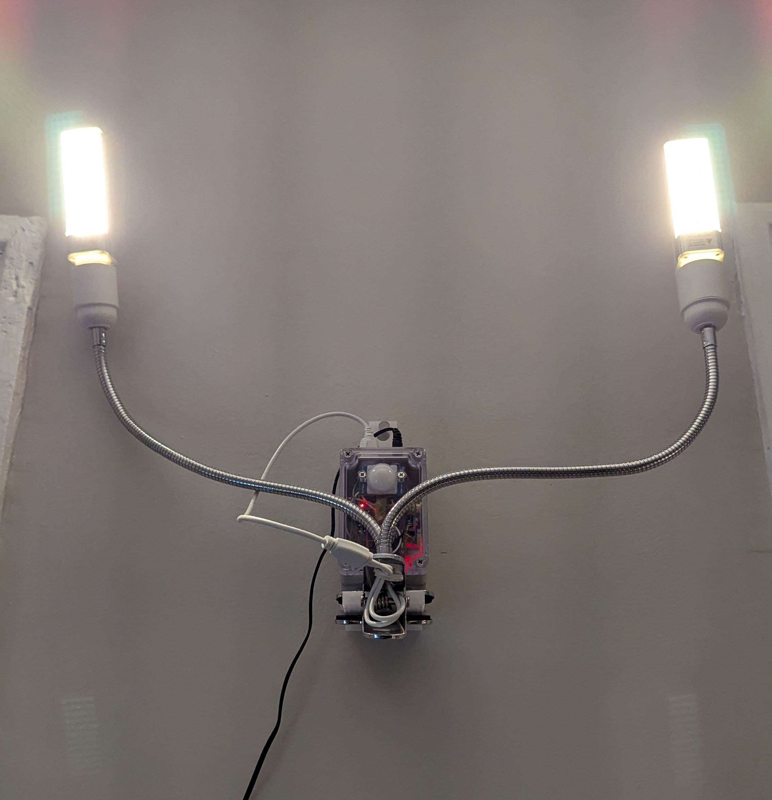

Lua code, scripts, and firmware for my smart light project.

It supports motion activation (with a sonar sensor), as well as dimming and wifi control via a simple web interface.

## How to use
You can flash this to your esp8266 (with nodemcu on it), change the pin numbers correspondingly, and it should work, assuming you have some sort of MOSFET or PWM inputs hooked up.

### Photos
#### Assembled with a custom 3D printed hook

