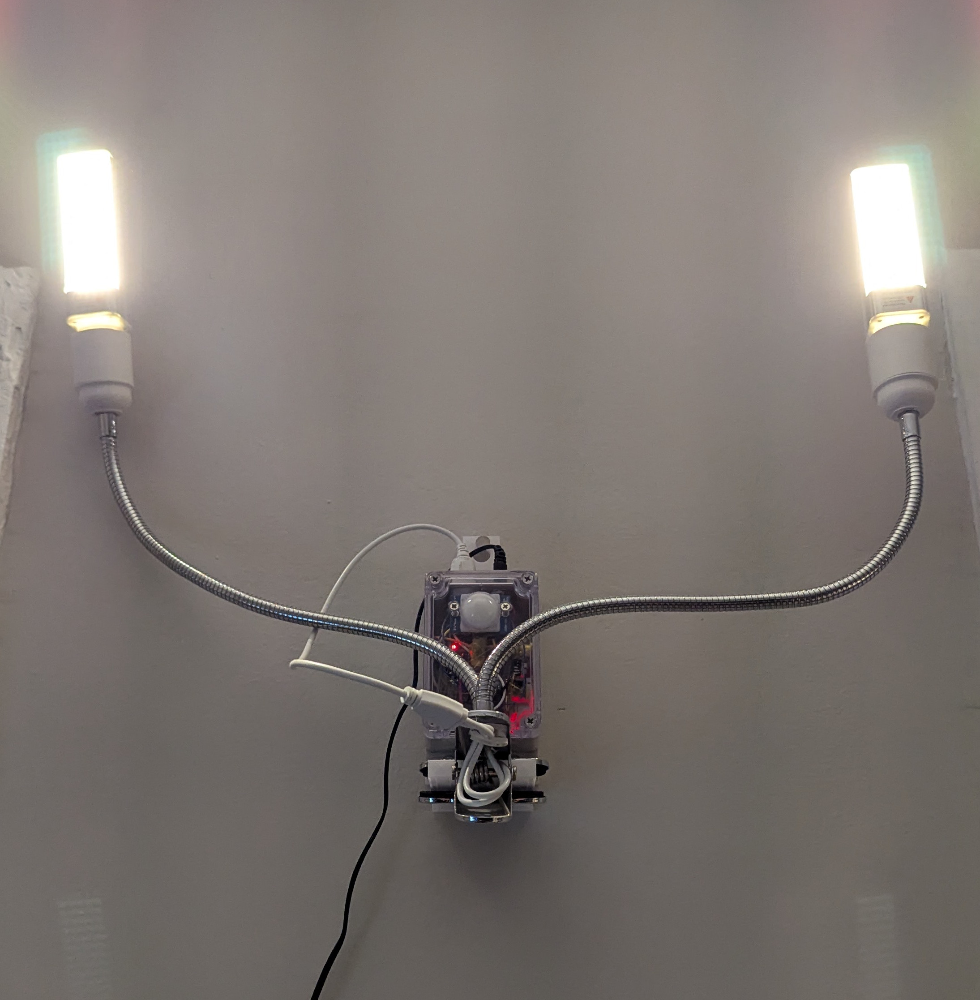

Lua code, scripts, and firmware for my smart light project.

It supports motion activation (with a sonar sensor), as well as dimming and wifi control via a simple web interface.

## How to use
You can flash this to your esp8266 (with nodemcu on it), change the pin numbers correspondingly, and it should work, assuming you have some sort of MOSFET or PWM inputs hooked up.

When started, it will create a WiFI network that you can connect to and input your regular WiFI credentials and select a network, then it will remember those credentials and connect over your regular network. I recommend giving it a static IP address, as the esp8266 does not have enough memory to run mDNS in this configuration without being unreliable I found.

### Photos
#### Assembled with a custom 3D printed hook

